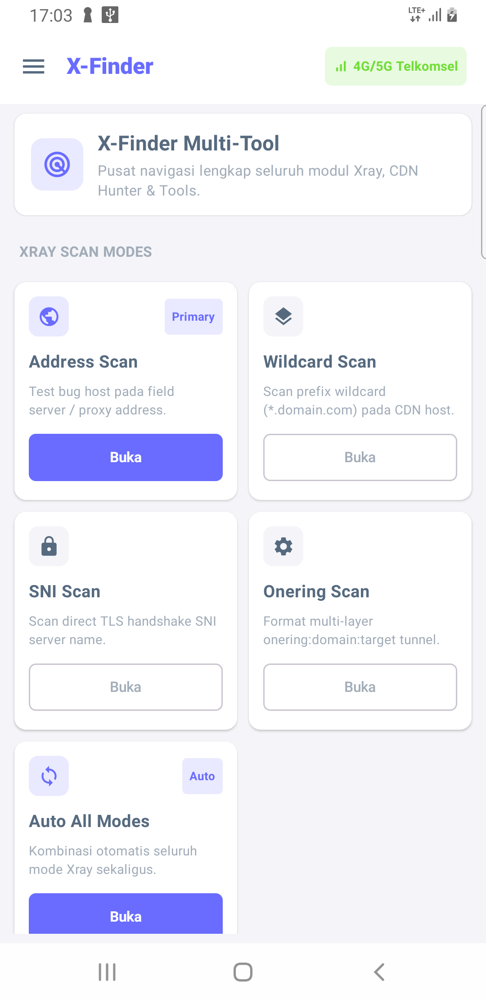
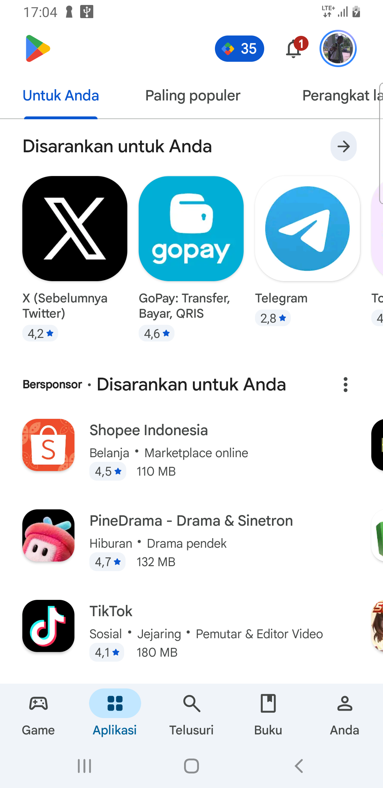
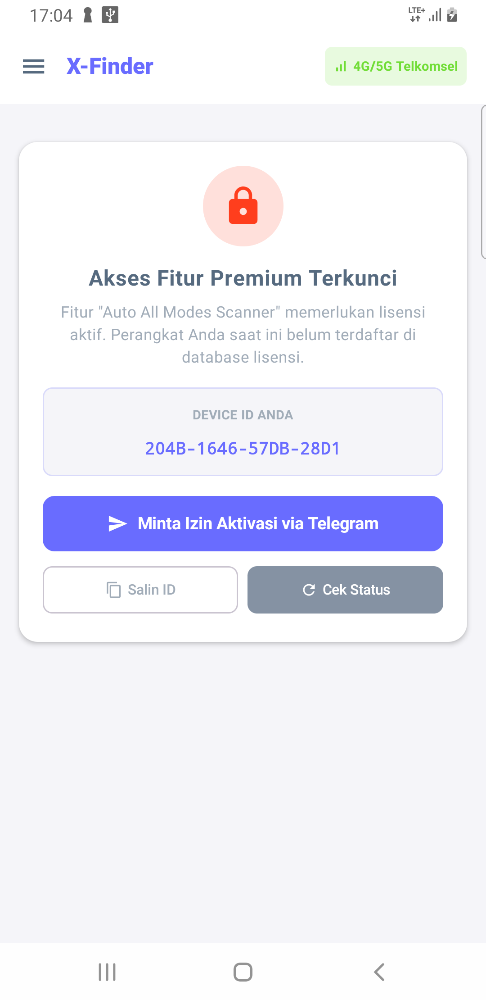

<div align="center">

# ⚡ X-Finder (Android Network & Bug Hunter Scanner)

[](https://github.com/lutfiwidianto/x-finder-releases)
[](https://github.com/lutfiwidianto/x-finder-releases)
[](https://t.me/xfinder_auth_bot)
[](https://github.com/lutfiwidianto/x-finder-releases)

**Aplikasi Android All-in-One untuk Network Diagnostic, Multi-Engine Xray & SSH-Websocket Scanner, CDN Bug Hunter, dan Subdomain Reconnaissance.**

[📥 Download APK Terbaru](x-finder.apk) • [📖 Panduan Aktivasi](#-panduan-penggunaan--aktivasi-lisensi) • [💬 Hubungi Pengembang](https://t.me/widianto_lutfi)

</div>

---

## 📱 Apa Sebenarnya Aplikasi X-Finder Ini?

**X-Finder** adalah aplikasi Android multifungsi untuk pengujian jaringan, optimasi proxy, dan pemindaian bug host secara cepat dan akurat langsung dari ponsel Anda:

1. **Mencari & Menguji Bug Host CDN / Proxy**: Menguji respon HTTP, status code (*101 Switching Protocols, 200 OK, 301/302 Redirect*), latency respon (*ping/ms*), serta ketersediaan IP address atau domain CDN (Cloudflare, Cloudfront, Akamai, Fastly, dll).
2. **Multi-Protocol Xray & SSH-Websocket Scanner**: Memvalidasi kesiapan protokol Vless, Vmess, Trojan, dan SSH Websocket melalui berbagai metode pemindaian (Address Scan, Wildcard Scan, SNI Handshake Scan, dan Onering Scan).
3. **Reconnaissance Subdomain & DNS Hunter**: Menggali daftar subdomain target secara otomatis, pemindaian status server live, pencarian reverse IP tetangga satu server, hingga pencarian kata kunci domain.
4. **Export & Manajemen Hasil Scan**: Menyimpan, menyalin, dan mengekspor hasil temuan konfigurasi terbaik dengan latency terendah langsung dari HP.

---

## 🎯 Untuk Siapa Aplikasi Ini Dibuat?

- **Pengguna Aplikasi Tunneling / VPN / Proxy di Android**: Membutuhkan tool cepat untuk mencari bug host aktif dan menguji performa koneksi.
- **Network Engineer & Sysadmin**: Menguji latency TLS Handshake SNI, header Websocket, dan responsivitas edge server langsung dari smartphone.
- **Pegiat Jaringan & Komunitas**: Ingin aplikasi pemindai berdesain modern, ringan, hemat baterai, dan berjalan super cepat tanpa lag.

---

## 🖼️ Tampilan Aplikasi (Preview & Demo)

<div align="center">
  
  &nbsp;&nbsp;
  
  &nbsp;&nbsp;
  
</div>

---

## ✨ Fitur-Fitur Unggulan

### 1. 🚀 Xray Multi-Mode Scanner
- **Address Scan**: Memindai kandidat IP address atau proxy server pada port tertentu.
- **Wildcard Scan**: Menguji responsivitas wildcard subdomain (*.domain.com) pada CDN host.
- **SNI Scan**: Menguji jabat tangan (*handshake*) TLS SNI server name langsung ke server target.
- **Onering Scan**: Pengujian format multi-layer tunnel `onering:domain:target`.
- **Auto All Modes (Fitur Unggulan)**: Menggabungkan seluruh metode pemindaian secara paralel dan otomatis menampilkan konfigurasi terbaik dengan latency terendah.

### 2. 🔍 Subdomain & Recon Suite
- **Subdomain Scanner**: Menggali puluhan hingga ratusan subdomain target secara otomatis.
- **Live Status Checker**: Memfilter subdomain mana yang aktif menghasilkan respon HTTP/HTTPS valid.
- **Reverse IP Lookup**: Menemukan domain-domain lain yang berada dalam satu alamat IP server target.

### 3. 🛡️ Keamanan Tingkat Tinggi (Hardware TEE DRM Silicon)
- **Bukan Berbasis IMEI / Android ID Biasa**: Device ID dihasilkan langsung dari enkripsi hardware silicon **MediaDrm Widevine TrustZone**.
- **Anti-Spoofing & Anti-Clone**: Tahan terhadap manipulasi Custom ROM, Magisk Device Spoofer, ataupun aplikasi *clone*.
- **Offline-Safe Smart Lease**: Berkat sistem *Smart Leased Cache*, aplikasi tetap berjalan super cepat (0 ms) tanpa membebani kuota internet setiap kali membuka fitur.

---

## 🚀 Panduan Penggunaan & Aktivasi Lisensi

Aktivasi lisensi X-Finder dibuat sangat mudah dan **100% aman** tanpa perlu mengetik manual username atau kode acak:

```
[Buka X-Finder] ➡️ [Klik 'Minta Izin Aktivasi via Telegram'] ➡️ [Tekan START di Bot] ➡️ [Admin Setujui] ➡️ [Tekan 'Cek Status' di Aplikasi]
```

### Langkah-langkah Detail:
1. **Unduh & Pasang APK**:
   Download file [x-finder.apk](x-finder.apk) lalu pasang di perangkat Android Anda.
2. **Buka Aplikasi**:
   Pilih fitur **Auto All Modes Scanner** atau menu lain yang memerlukan lisensi.
3. **Minta Izin Aktivasi**:
   - Layar akan menampilkan kartu **Akses Fitur Premium Terkunci** beserta **Device ID** perangkat Anda.
   - Klik tombol biru **"Minta Izin Aktivasi via Telegram"**.
4. **Konfirmasi di Bot Telegram**:
   - Aplikasi akan otomatis membuka Telegram ke bot [`@xfinder_auth_bot`](https://t.me/xfinder_auth_bot).
   - Tekan tombol **START** di bot. Akun Telegram dan Device ID Anda akan otomatis terkirim secara aman ke antrian Admin.
5. **Aktivasi Selesai**:
   - Setelah Admin menyetujui permohonan Anda di bot, kembali ke aplikasi X-Finder dan tekan tombol **"Cek Status"**.
   - Fitur langsung terbuka seketika!

---

## ❓ Tanya Jawab Umum (FAQ)

<details>
<summary><b>1. Apakah aplikasi ini membutuhkan akses Root?</b></summary>
Tidak. X-Finder dapat berjalan optimal di semua ponsel Android (Android 7.0 hingga Android 15+) baik yang sudah di-root maupun non-root.
</details>

<details>
<summary><b>2. Mengapa aplikasi tetap bisa dipakai saat offline?</b></summary>
X-Finder menggunakan sistem HMAC-signed smart lease lokal yang aman. Begitu status lisensi Anda terverifikasi, aplikasi menyimpan sertifikat tanda tangan digital lokal sehingga tidak perlu terus-menerus menghubungi internet.
</details>

<details>
<summary><b>3. Apa yang terjadi jika Admin mencabut lisensi perangkat saya?</b></summary>
Perangkat Anda akan kembali ke status terkunci. Anda dapat mengajukan permohonan izin baru kapan saja melalui tombol yang sama.
</details>

---

## 👨‍💻 Kontak & Dukungan

Jika Anda memiliki pertanyaan seputar perizinan, bug report, atau saran pengembangan fitur:

- **Telegram Pengembang**: [@widianto_lutfi](https://t.me/widianto_lutfi)
- **Bot Lisensi**: [@xfinder_auth_bot](https://t.me/xfinder_auth_bot)

<div align="center">
<sub>© 2026 X-Finder Project • Aplikasi Android Berperforma Tinggi & Aman.</sub>
</div>
